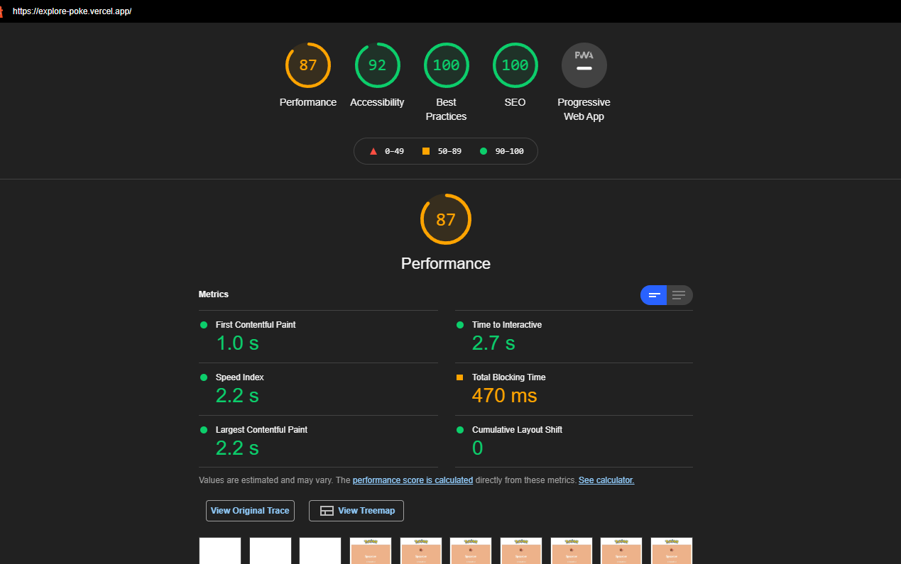
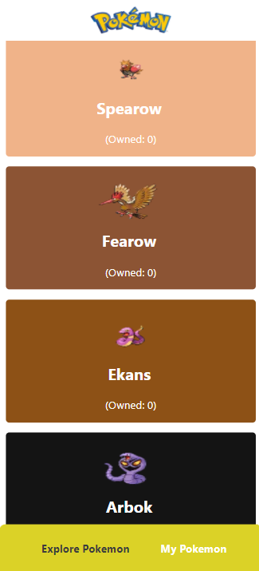
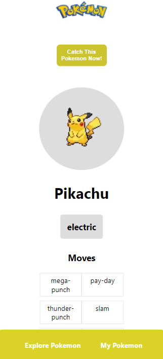

# Explore-Poke

Explore-Poke is a web to explore various types of pokemon that exist around the world.

This is a [Next.js](https://nextjs.org/) project bootstrapped with [`create-next-app`](https://github.com/vercel/next.js/tree/canary/packages/create-next-app).

## The main version of this repository is in the [poke-ssg](https://github.com/mfaridzia/explore-poke/tree/poke-ssg) branch (using ssg mode)

## Live Demo

[Explore-Poke](https://explore-poke.vercel.app/) (https://explore-poke.vercel.app/)

#

## Lighthouse Score (13/01/2022)



#

<p>
  
  
</p>

#

## Getting Started

Clone this repository and run the following command in terminal to install the package.

```
npm install
```

After that, run the development server:

```bash
npm run dev
# or
yarn dev
```

Open [http://localhost:3000](http://localhost:3000) with your browser to see the result.

## Tools

- React Hooks
- Next.js
- Apollo Client
- Emotion CSS

## Learn More

To learn more about Next.js, take a look at the following resources:

- [Next.js Documentation](https://nextjs.org/docs) - learn about Next.js features and API.
- [Learn Next.js](https://nextjs.org/learn) - an interactive Next.js tutorial.

You can check out [the Next.js GitHub repository](https://github.com/vercel/next.js/) - your feedback and contributions are welcome!

## Deploy on Vercel

The easiest way to deploy your Next.js app is to use the [Vercel Platform](https://vercel.com/new?utm_medium=default-template&filter=next.js&utm_source=create-next-app&utm_campaign=create-next-app-readme) from the creators of Next.js.

Check out our [Next.js deployment documentation](https://nextjs.org/docs/deployment) for more details.
